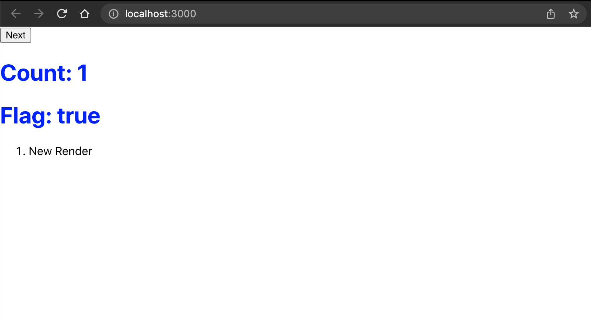

# React.js v18 Auto-Batching Demo

Example use case is when you have several `useState` hooks to update in a single event handler. In React 18 there will be improved performance when doing this called autobatching. This will eliminate the rendering of components “Half-Finished”.

The Repo holds two subdirectories, one showing updates with auto batching (v18) and one without it (v17). In both repos the same functionality is repeated: A flag and a count state are updated each time a button is pressed. Both set state updates happen inside the same click handler. Each time the `App` component re-renders (first render isn't counted) it will be displayed in an ordered list in the same view. You will notice more re-renders with v17 than with v18, thus demonstrating the practicality of autobatching.

